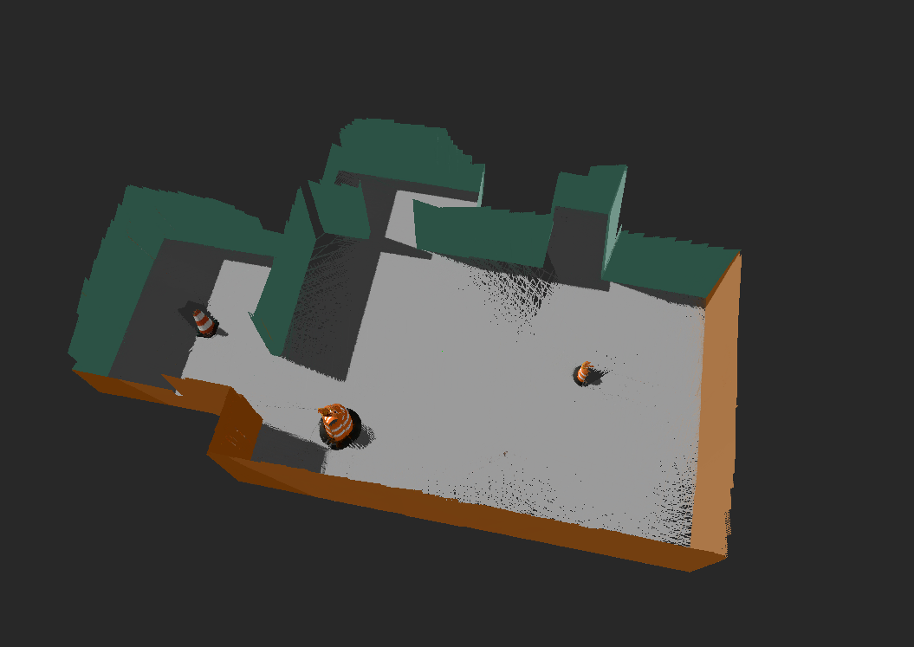
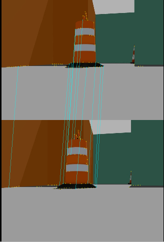
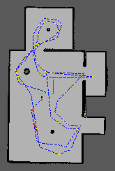

# Map My World


**Map My World** is a ROS (Robot Operating System) project that utilizes the `rtambmap_ros` package to create a map of the environment. This repository contains the necessary code and instructions to get started with environment mapping using a robot equipped with the ROS framework.

**RTABMAP** (Real-Time Appearance-Based Mapping) is a RGB-D Graph-Based SLAM approach based on an incremental appearance-based global Bayesian loop closure detector.

RTABMAP combines gmapping with 3D SLAM in order to do autonomous navigation. Along with 3D point cloud data from the depth sensor, RTABMAP also collects 2D and 3D laser scan data.

## Prerequisites

Before you can start mapping your environment using this repository, make sure you have the following prerequisites installed:

- [ROS Melodic or Noetic](http://wiki.ros.org/ROS/Installation)
- [rtambmap_ros](https://github.com/rtambmap/rtambmap_ros)
    ```bash
    sudo apt-get install ros-${ROS_DISTRO}-rtabmap-ros
    ``` 
- [Gazebo](http://gazebosim.org/)
- [RViz](http://wiki.ros.org/rviz)
- [teleop_twist_keyboard](https://github.com/ros-teleop/teleop_twist_keyboard.git)
## Installation

1. Clone this repository to your ROS workspace:
   ```bash
   git clone https://github.com/Y-Hegazi/Map-My-World.git```

2. Build package
   ```bash
   cd /path/to/yourworkspace
   catkin_make
   source devel/setup.bash 
    ```
3. Launch:
   ```bash
   roslaunch my_robot world.launch 
   roslaunch my_robot mapping.launch #mapping_noetic.launch #for noetic users
    ```

## Visualizing RTABMAP data
**3dMap**


**Features Detection**


**2dMap**


